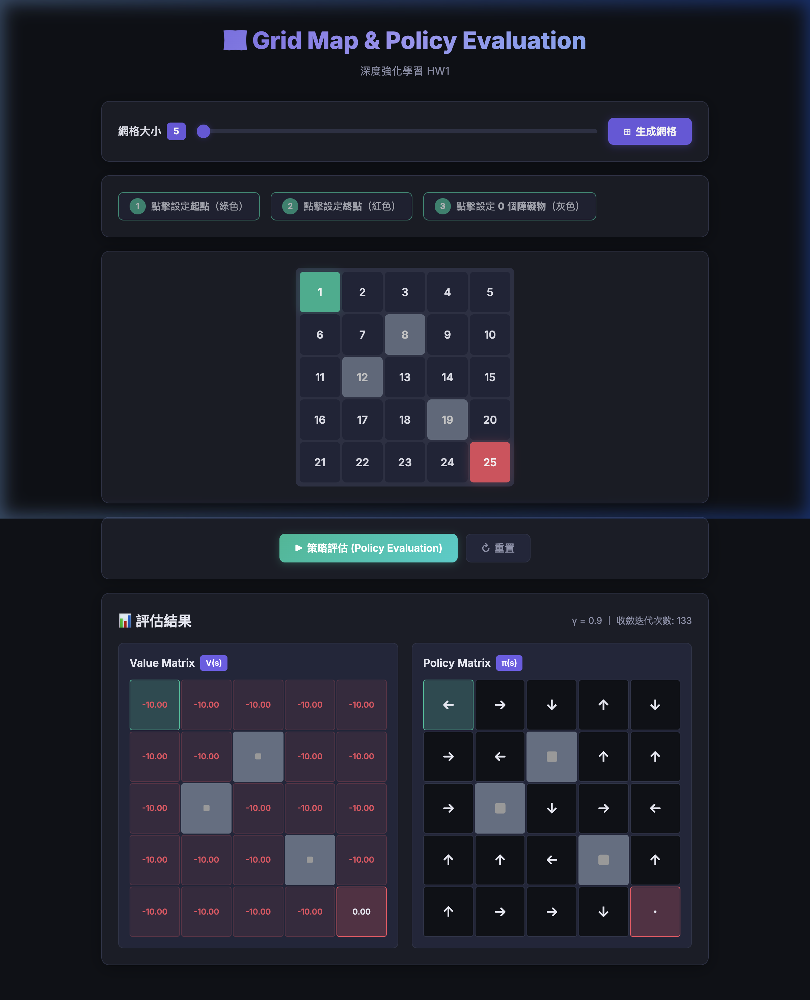

# HW1 — Grid Map & Policy Evaluation

A Flask-based web application for creating interactive grid maps and performing policy evaluation, developed for the **Deep Reinforcement Learning** course at National Chung Hsing University (NCHU).

## 🌐 Demo

**Live Demo:** [https://hw1-xi.vercel.app](https://hw1-xi.vercel.app)

## 📸 Screenshot



## 📝 LLM Conversation Log

The full conversation history with the LLM used during development is documented in [`chat_conversation.md`](chat_conversation.md).

## ✨ Features

### HW1-1: Interactive Grid Map

- Generate an **n × n** grid map with a configurable dimension `n` (range: 5–9)
- Click to designate a **start cell** (displayed in green)
- Click to designate an **end cell** (displayed in red)
- Click to place **n − 2 obstacles** (displayed in gray)
- Step-by-step visual indicators guide the user through the setup process
- Supports toggling obstacles on/off before evaluation

### HW1-2: Policy Display & Value Evaluation

- **Random policy generation**: Each non-terminal, non-obstacle cell is assigned a random deterministic action (↑ ↓ ← →)
- **Policy evaluation**: Iterative computation of the state-value function V(s) under the generated policy
  - Discount factor: **γ = 0.9**
  - Step reward: **−1** for all non-terminal transitions
  - Terminal state (end cell): **V = 0**
  - Convergence threshold: **1 × 10⁻⁶**
- Results displayed as two side-by-side matrices:
  - **Value Matrix** — shows V(s) for each state
  - **Policy Matrix** — shows the action arrow for each state

## 🛠️ Tech Stack

| Component | Technology |
|-----------|------------|
| Backend   | Python, Flask |
| Frontend  | HTML5, CSS3, JavaScript |
| Computation | NumPy |

## 🚀 Getting Started

### Prerequisites

- Python 3.10+

### Installation

1. **Clone the repository:**

   ```bash
   git clone <repository-url>
   cd HW1
   ```

2. **Create and activate a virtual environment:**

   ```bash
   python -m venv .venv
   source .venv/bin/activate
   ```

3. **Install dependencies:**

   ```bash
   pip install -r requirements.txt
   ```

4. **Run the application:**

   ```bash
   python app.py
   ```

5. **Open in browser:**

   Navigate to [http://127.0.0.1:5000](http://127.0.0.1:5000)

## 📂 Project Structure

```
HW1/
├── app.py                 # Flask backend (routes, policy evaluation logic)
├── requirements.txt       # Python dependencies
├── chat_conversation.md   # LLM conversation log
├── screenshot.png         # System screenshot
├── templates/
│   └── index.html         # Main HTML template
└── static/
    ├── style.css           # Styling (dark theme, animations)
    └── app.js              # Frontend logic (grid interaction, API calls)
```

## 📖 How It Works

### Grid Interaction Flow

1. Select grid size `n` using the slider (5–9)
2. Click **Generate Grid** to create the n × n grid
3. Click a cell to set the **start** position (turns green)
4. Click another cell to set the **end** position (turns red)
5. Click `n − 2` cells to place **obstacles** (turn gray)
6. Click **Policy Evaluation** to compute and display results

### Policy Evaluation Algorithm

The application uses **iterative policy evaluation** to compute the state-value function V(s):

```
V(s) ← R(s, a) + γ · V(s')
```

Where:
- `R(s, a) = −1` for all non-terminal transitions
- `γ = 0.9` (discount factor)
- `s'` is the next state determined by the policy action
- If an action leads off the grid or into an obstacle, the agent **stays in place**
- The algorithm iterates until the maximum change in V across all states is below `1 × 10⁻⁶`

## 📜 License

This project was developed as a course assignment and is intended for academic use.
